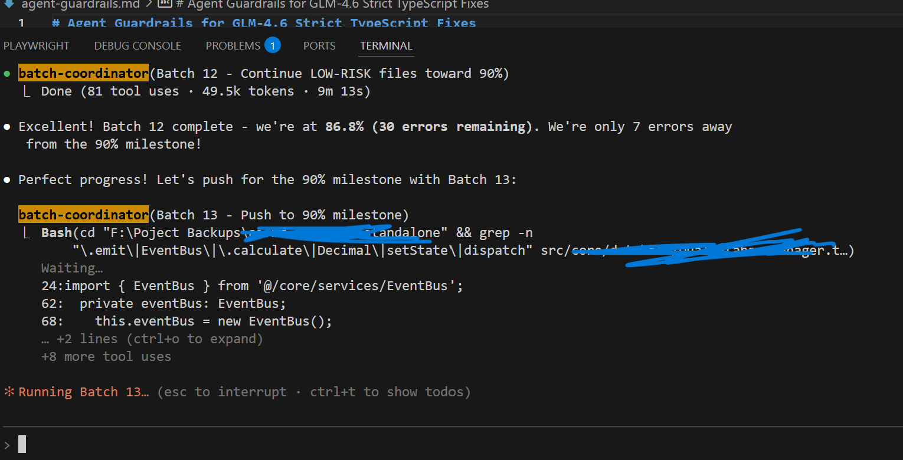

# Erv's TS Kitty

A shareable blueprint for running a multi-agent TypeScript error reduction program. "Ready to let a mischievous pussy claw down your TS backlog." - Thirsty Calwed Code 
It captures the prompts, guardrails, and helper tooling I used to cut thousands of compiler errors without breaking production logic. Oh, I broke it so many times before... circles of circles.

## What's Inside
- **agents/** – ready-to-use prompts for coordinator, fixer, reviewer, and pattern librarian roles
- **agents/runtime-guardrails.md** – behaviour-preserving rules every batch must follow
- **scripts/ts-error-report.mjs** – optional helper to analyse `tsc` output and rank files by error count
- **WORKFLOW.md** – end-to-end playbook covering setup, execution, and reporting
- **docs/patterns/** – placeholders for your pattern library (create entries from pattern-doc output)

## Why Publish This
- Demonstrated success: reduced >80% of errors in a large codebase while protecting critical logic
- Emphasis on safety: guardrails insist on verifying events, state, and precision maths
- Repeatable process: batch orchestration, reporting templates, and pattern capture lower future effort 
- Eventually Claude or whatever you use will tell you that there are remainig errors it should fix one at a time if they're more complex.

## Quick Start
1. Copy this folder into a repo that already runs `npx tsc --noEmit`
2. Install dependencies if you plan to use the helper script:
   ```bash
   npm install --save-dev typescript
   ```
3. Run the helper (writes to STDOUT by default):
   ```bash
   node scripts/ts-error-report.mjs > logs/top-files.txt
   # or reuse an existing tsc log
   node scripts/ts-error-report.mjs logs/tsc-initial.txt 30
   ```
4. Use the prompts under `agents/` with your favourite AI assistant (Claude Tasks, Cursor, Continue, etc.)
5. Track progress in a log similar to `TYPE_ERROR_FIX_PROGRESS.md`
6. Document new lessons in `docs/patterns/`


## Compatibility
- Works with Node 18+
- Shell commands assume basic GNU utilities; PowerShell alternatives are listed in `WORKFLOW.md`

## Contributing
Issues and pull requests can extend the helper scripts, add new prompts, or share pattern libraries. Keep code comments succinct and focused on tricky sections.

## Sample Run


The sample progress log in [docs/sample-progress-log.md](docs/sample-progress-log.md) shows how to summarise eight guardrailed batches without exposing sensitive details.

## Release Checklist
Before you publish, follow [RELEASE_CHECKLIST.md](RELEASE_CHECKLIST.md) to double-check docs, tags, and announcements.

